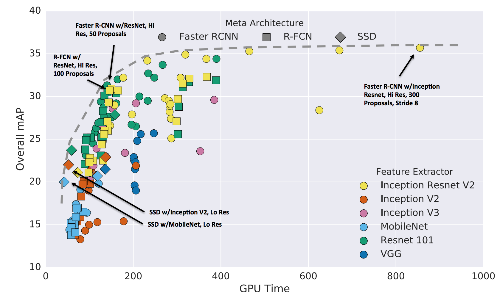
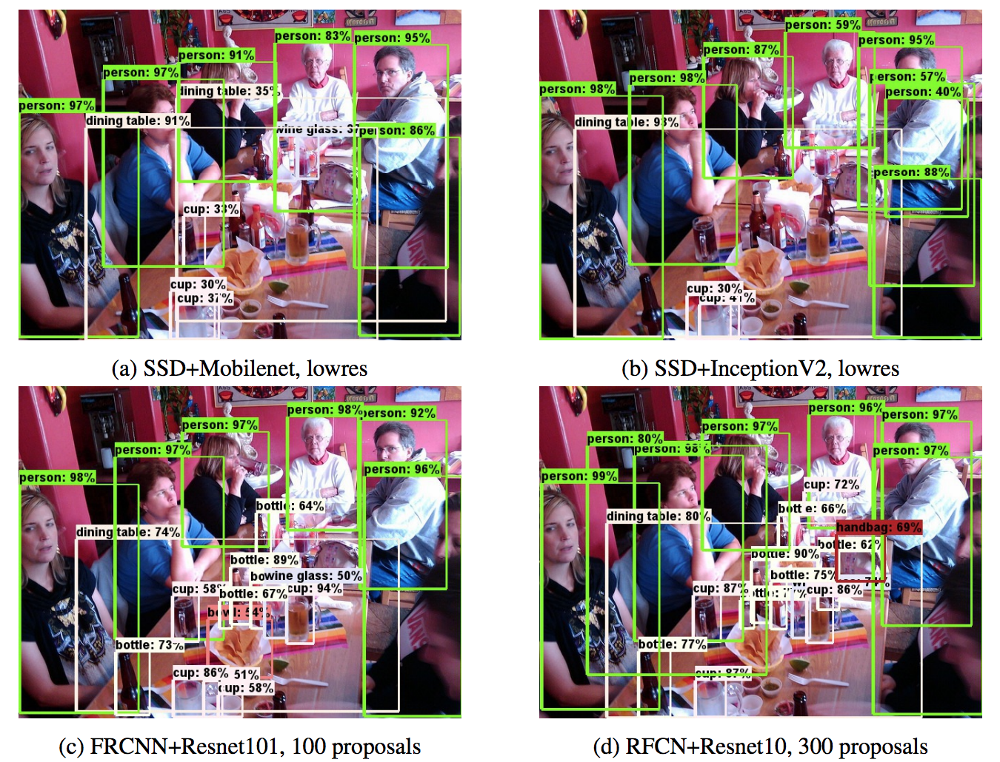
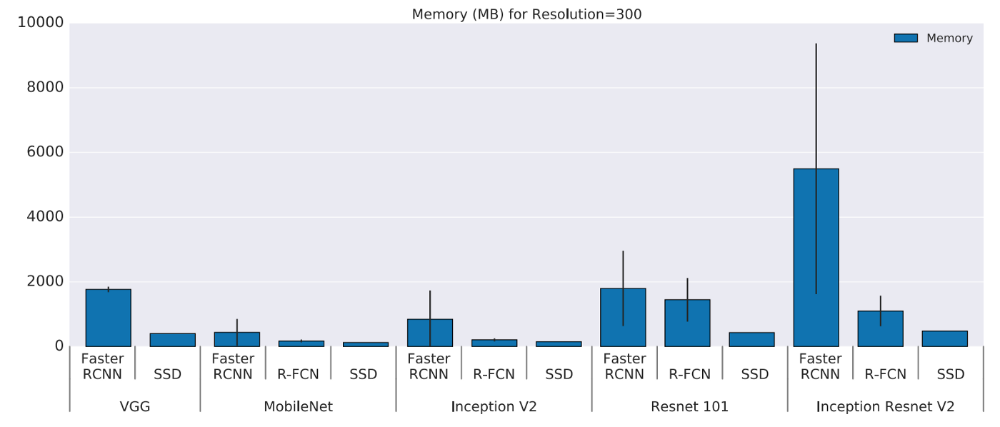
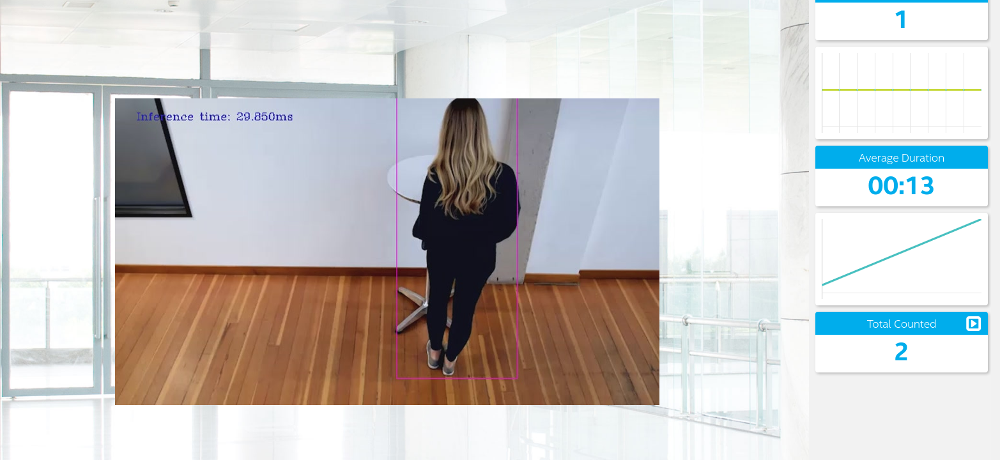
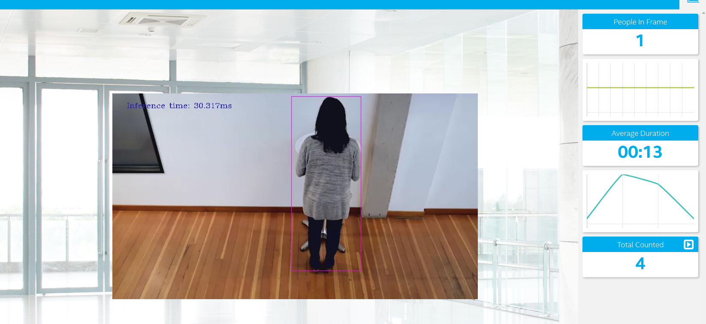

# People Counter App at the Edge
The people counter application will demonstrate how to create a smart video IoT solution using Intel® hardware and software tools. The app will detect people in a designated area, providing the number of people in the frame, the average duration of people in the frame, and total count.

People counting applications can be used in a *retail store*, *supermarket*, *shopping malls*, *metro station*, *airport*. For example, Once a person is detected, We can follow the object through a shopping pipeline in a retail setting or track and collate behavior i.e. customer traffic patterns and time spent at merchandising location.

## Architecture Overview of the People Counter App


## Explaining Custom Layers
OpenVINO Toolkit Documentations has a list of Supported Framework Layers for DL Inference. Custom layers are layers that are not included in the list of known layers. If your topology contains any layers that are not in the list of known layers, the Model Optimizer classifies them as custom.

The process behind converting custom layers involves two necessary custom layer extensions:
- Custom Layer Extractor: Responsible for identifying the custom layer operation and extracting the parameters for each instance of the custom layer. The layer parameters are stored per instance and used by the layer operation before finally appearing in the output IR. Typically the input layer parameters are unchanged, which is the case covered by this tutorial
- Custom Layer Operation : Responsible for specifying the attributes that are supported by the custom layer and computing the output shape for each instance of the custom layer from its parameters.

To explore this topic further it is worth exploring the sources given below;


Sources
- https://docs.openvinotoolkit.org/latest/_docs_HOWTO_Custom_Layers_Guide.html
- https://www.youtube.com/watch?v=UrfWgFKjaPc


## Comparing Model Performance
To evaluate the performance of different models for this use case, I have taken two approaches. 
- *Approach 1*  - Using a theoretical approach to go through the available literature on comparison of different object detection models
- *Approach 2* - Using [Benchmark Python Tool](https://docs.openvinotoolkit.org/latest/_inference_engine_tools_benchmark_tool_README.html) available as part of OpenVINO toolkit tools. It is a very useful tool available to analyze the performance attributes such as throughput and latency of different models 

### Approach # 1 (Theoretical Review)

After reviewing the [paper](https://arxiv.org/pdf/1611.10012.pdf) and the [medium post](https://medium.com/@jonathan_hui/object-detection-speed-and-accuracy-comparison-faster-r-cnn-r-fcn-ssd-and-yolo-5425656ae359), following conclusion can be made.

- R-FCN and SSD models are faster on average but cannot beat the Faster R-CNN in accuracy if speed is not a concern.

- Input image resolution impacts accuracy significantly. Reduce image size by half in width and height lowers accuracy by 15.88% on average but also reduces inference time by 27.4% on average.

- The most accurate single model use Faster R-CNN using Inception ResNet with 300 proposals. It runs at 1 second per image.



- SSD with MobileNet provides the best accuracy tradeoff within the fastest detectors. SSD is fast but performs worse for small objects comparing with others.
See picture below for comparison.

- For large objects, SSD can outperform Faster R-CNN and R-FCN in accuracy with lighter and faster extractors.



- SSD has the smallest memory size footprint among the commonly used models.





After reviewing the literature for the particular use case it seems that SSD+mobilenet based model is the based choice for the following reasons;
- SSD person reasonably faster when small objects are not to be detected. In our case we will be detecting people.
- Since, this app has to be deployed on an edge device in real world therefore, it made more sense to use a model with the least memory footprint.

### Approach # 2 (Benchmark Python Tool)

The second approach here was to use the benchmark tool available in the tools section of OpenVINO toolkit. Available here;
 */opt/intel/openvino/deployment_tools/tools/benchmark_tool/benchmark_app.py*

 Through this tool we are able to compare some important attributes of the models such as Latency and Throughput. The three models for COCO dataset that are considered are;

 - Faster_RCNN_V2_Inception
 - SSD MobileNet V2
 - SSD Lite MobileNet V2

 Below tables show the comparison. 


  ### Model size (MB)

|                   | Faster_RCNN_V2_Inception | SSD Mobilenet V2| SSDLite MobileNet V2| 
| ----------------- | ---------------- | ---------------- | ---------------- |------------------------------|
| Before Conversion | 174            |    210.7        | 62.5            | N/A                          |
| After Conversion FP32  | 53.6          | 67.3          | 18.3            | 3.2                         |
| After Conversion FP16 | 27        | 34         | 9.3 | 


### Latency(ms)

|                   | Faster_RCNN_V2_Inception | SSD Mobilenet V2| SSDLite MobileNet V2|
| ----------------- | ---------------- | ---------------- | ---------------- |------------------------------|
| Before Conversion | 174            |    210.7        | 62.5            | N/A                          |
| After Conversion FP32  | 53.6          | 67.3          | 18.3            | 3.2                         |
| After Conversion FP16 | 27        | 34         | 9.3 |

### Throughput (FPS)

|                   | Faster_RCNN_V2_Inception | SSD Mobilenet V2| SSDLite MobileNet V2| 
| ----------------- | ---------------- | ---------------- | ---------------- |------------------------------|
| Before Conversion | 174            |    210.7        | 62.5            | N/A                          |
| After Conversion FP32  | 53.6          | 67.3          | 18.3            | 3.2                         |
| After Conversion FP16 | 27        | 34         | 9.3 | 


<b> From the tables, one can conclude the best choice here is to use SSDLite MobileNet V2 model. Although, SSDLite is not the most accurate model but for this particular case we can achieve reasonable results using this model </b>.

## Downloading and Converting the Model

All the models are stored in the models directory. 

** Make sure before running the command below for conversion that you are in the directory where the downloaded model is located. In this application all the models are located in the models directory.

### SSDLite_MobileNetV2_COCO

```
cd models/

wget http://download.tensorflow.org/models/object_detection/ssdlite_mobilenet_v2_coco_2018_05_09.tar.gz

tar -xvf ssdlite_mobilenet_v2_coco_2018_05_09.tar.gz

mkdir ssdlite_MO_model

python3 /opt/intel/openvino/deployment_tools/model_optimizer/mo_tf.py --input_model ssdlite_mobilenet_v2_coco_2018_05_09/frozen_inference_graph.pb --tensorflow_use_custom_operations_config  /opt/intel/openvino/deployment_tools/model_optimizer/extensions/front/tf/ssd_v2_support.json --tensorflow_object_detection_api_pipeline_config ssdlite_mobilenet_v2_coco_2018_05_09/pipeline.config --data_type FP32 -o ssdlite_MO_model/FP32

```
## Running the application

To run the application use the following steps below. For every step open a seperate Terminal. 

From the main directory:

### Step 1 - Start the Mosca server

```
cd webservice/server/node-server
node ./server.js
```

You should see the following message, if successful:
```
Mosca server started.
```

### Step 2 - Start the GUI

Open new terminal and run below commands.
```
cd webservice/ui
npm run dev
```

You should see the following message in the terminal.
```
webpack: Compiled successfully
```

### Step 3 - FFmpeg Server

Open new terminal and run the below commands.
```
sudo ffserver -f ./ffmpeg/server.conf
```

### Step 4 - Run the code

Open a new terminal to run the code. 

#### Setup the environment

<b> Make  sure you are in the home directory. In the case of workspace it is /home/workspace/.. </b>

You must configure the environment to use the Intel® Distribution of OpenVINO™ toolkit one time per session by running the following command:
```
source /opt/intel/openvino/bin/setupvars.sh -pyver 3.5
```

You should also be able to run the application with Python 3.6, although newer versions of Python will not work with the app.

#### Running on the CPU


When running Intel® Distribution of OpenVINO™ toolkit Python applications on the CPU, the CPU extension library is required. This can be found at: 

```
/opt/intel/openvino/deployment_tools/inference_engine/lib/intel64/
```

*Depending on whether you are using Linux or Mac, the filename will be either `libcpu_extension_sse4.so` or `libcpu_extension.dylib`, respectively.* (The Linux filename may be different if you are using a AVX architecture)

Though by default application runs on CPU, this can also be explicitly specified by ```-d CPU``` command-line argument:

```
python main.py -i resources/Pedestrian_Detect_2_1_1.mp4 -m /home/workspace/models/ssdlite_MO_model/FP32/frozen_inference_graph.xml -l /opt/intel/openvino/deployment_tools/inference_engine/lib/intel64/libcpu_extension_sse4.so -d CPU -pt 0.6 | ffmpeg -v warning -f rawvideo -pixel_format bgr24 -video_size 768x432 -framerate 24 -i - http://0.0.0.0:3004/fac.ffm
```
If you are in the classroom workspace, use the “Open App” button to view the output. 

If working locally, to see the output on a web based interface, open the link [http://0.0.0.0:3004](http://0.0.0.0:3004/) in a browser.


## Screenshots





### Differences in Edge and Cloud computing

Important aspects to consider are latency, bandwidth and cost. In applications which are mission critical and customer cannot afford any delay it is better to consider an edge application. Furthermore, in the domain of video analytics sending a video file to the cloud for analytics will not only be dependent on the bandwidth but it will increase the cost of the project drastically because of the large size of the data to be stored in the cloud. 
For video analytics applications such as this one a better tradeoff is to do the analytics at the edge and only send the relevant information to the cloud for  insights and richer UI dashboard experience. 


## Assess Model Use Cases

Some of the potential use cases of the people counter app are:
- *Retail -* 
  In Retail this application can be used to have better information about the customers footfall and how footfall and sales are related to improve efficiency and sales
- *Security systems -*
In any particular facility where it is required to have information on the amount of people passed through and are currently present in the building - this application can be used
- *Queue Management -* 
As this application provides the time a person stayed in the frame, it can also be used with some modificaiton for dwell time and queue management 
- *COVID related -* 
Last but not least in the healthcare facility if one can link this with the use of sanitizer one can detect how many people passed by to enter into the facility and if all of them have used the sanitizer from the sanitizer station 


## Assess Effects on End User Needs

Lighting, model accuracy, and camera focal length/image size have different effects on a deployed edge model. The potential effects of each of these are as follows:

 - *Lighting -*  Perhaps no other aspects of a computer vision model has consistently caused delays, false detections and detection failures than lighting. In an ideal scenario, lighting would maximize the contrast on features of interest, and would in turn make it easier for a model to detect separate instances of object, in our case person. Since most of the use cases of a people counter application rely on a static CCTV camera, it is critical to have a proper lighting in the area it aims to cover or it may cause false detections or no-detection at all.

- *Model Accuracy -* The model needs to be highly accurate if deployed in a mass scale as it may cause false detections or no-detection which can produce misleading data, and in case of retail applications may cause the company or business to lose money. 

- *Image Size/Focal Length -* It is critical to have a sharp and high resolution image as an input to our model to make it easy for it to perform segmentation easily and keep the features of interest detectable.


## BONUS/EXTRA WORK

### TRAINING OWN MODEL

During the course of this project, different tools that are available were explored. In particular, I was interested in Microsoft's Custom Vision API. 

https://azure.microsoft.com/en-us/services/cognitive-services/custom-vision-service/

 It is tool that can help to upload the images, tag them and then train them in the cloud. The train model can then be exported in the "ONNX" format which can be converted using model optimizer. Unfortunately, when I tried this I could not convert the ONNX model and encounter errors during conversion. Since, during the training phase in the custom vision, I did not have any option to change/select the base model to train the images it was not possible to solve this error, as I did not know which based model they used for the training and therefore, could not decide which custom layers to be use. 
Upon further investigation, I came across ONNX Runtime Engine with OpenVINO 

https://microsoft.github.io/ai-at-edge/docs/onnx_openvino/

As a future work, I am waiting for an Edge hardware to explore this further and deploy the app on the edge using ONNX Runtime engine.

I also have NCS stick at my disposal and initially I wanted to run the application locally on my Ubunutu 18.04 LTS and OpenVINO R2020.2 . The idea was to compare the results of FP32 and FP16 with CPU and NCS. Once I converted the models and selected SSDLite and ran the application locally I came across the issue of libcpu_extension_sse4.so. I was getting error while running using the extension. Upon some investigation I came across several posts where it was mentioned that the way extension library is used is changed in the latest version of OpenVINO. It was advised from on of the mentors on a post to go with the existing tools/versions as available on the workspace so that mentors can ensure they have similar tools when running the application at there end. 

